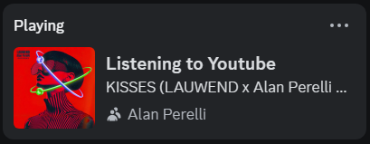

# dcrp-yt
A browser extension that displays YouTube's current playing video (from a playlist) as Discord activity.

## Features
- Supported platforms: Windows 10/11 (for now).
- Supported browsers: Mozilla (for now).
- Requires a host application to function properly.

## Note
This is a fun little side project that I did to learn some stuff. Might improve might not.

Using JavaScript SDK would have been better, but idc. Don't want to make this a major thingy.

## Install
Latest extension can be downloaded [here](https://github.com/martynasmuizys/dcrp-yt/releases/latest).

Native application installer can be downloaded [here](https://github.com/martynasmuizys/dcrp-yt/releases/download/v1.1.0/dcrp-yt-setup.msi)

## TODO
- See if it is possible to have dynamic images (from URL).
- Remove regex functionality. Replace it with UI to add playlists or something.

## Another note
Bing bong.
